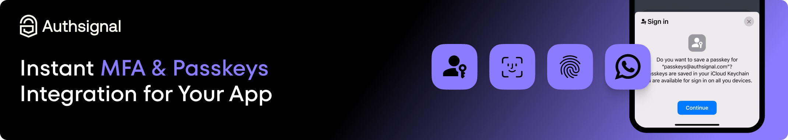

<div align="center">
  
</div>

</br>

# Passkeys in a Next.js App with Authsignal and NextAuth

This example shows how to integrate passkeys into a Next.js application using Authsignal + NextAuth.

## Introduction

Authsignal is a step-up authentication platform that seamlessly adds passkeys and MFA anywhere in your application, providing enhanced security exactly when you need it.

## Deploy

Deploy this example to Vercel, please not that you'll need to add environment variables.

<a href="https://vercel.com/new/clone?repository-url=https%3A%2F%2Fgithub.com%2Fauthsignal%2Fnext-auth-passkeys-example"></a>

## Overview

This demo uses NextAuth's built in email magic link provider for account creation and email magic link sign in. Once a user is logged in, they can create a passkey that can be used for signing in.

You will need to use your own email provider service to send magic links to users.

You will need to configure your Authsignal tenant to setup passkeys. Learn more here https://docs.authsignal.com/passkeys/getting-started.

## Running the application

1. **Install Dependencies**

   ```bash
   npm install
   ```

2. **Add Environment Variables**

   Copy the `.env.example` file to a new file named `.env.local` and fill in your environment variables.

3. **Setup Prisma**

   - Add your database provider to the datasource object in schema.prisma. The default is `postgresql`.

   - Generate the Prisma Client:

     ```bash
     npx prisma generate
     ```

   - Run the Prisma migration to configure your database to use the schema:
   
     ```bash
     npx prisma migrate dev
     ```

4. **Start the application**

   ```bash
   npm run dev
   ```

5. **Open the application**

   Navigate to [http://localhost:3000](http://localhost:3000) in your browser to see the application.


## Learn More

To learn more, check out the following resources:

- [Authsignal NextAuth Integration Docs](https://docs.authsignal.com/integrations/nextauth-js)
- [NextAuth Docs](https://next-auth.js.org/getting-started/introduction)
- [Prisma Docs](https://www.prisma.io/docs)
- [Next.js Docs](https://nextjs.org/docs)
